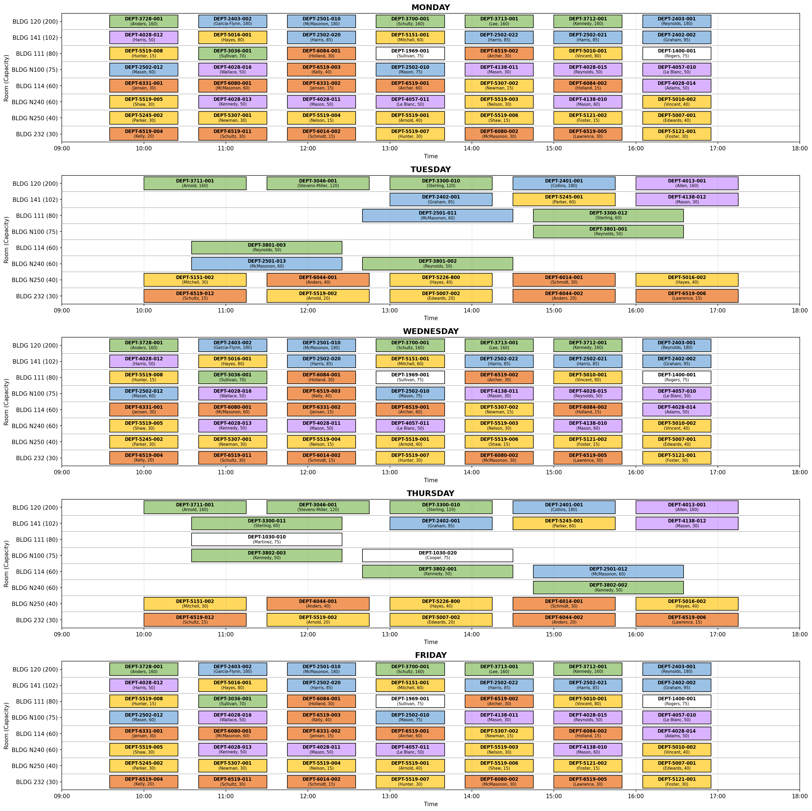

# Satisfaculty

A python course scheduling optimization tool using integer linear programming.

## Installation

```bash
pip install satisfaculty
```

For the latest development version:

```bash
pip install git+https://github.com/zsunberg/satisfaculty.git
```

## Usage

```python
from satisfaculty import *

scheduler = InstructorScheduler()

# example data files are in the example directory of this repo
scheduler.load_rooms('rooms.csv')
scheduler.load_courses('courses.csv')
scheduler.load_time_slots('time_slots.csv')

# Add constraints (required for a valid schedule)
scheduler.add_constraints([
    AssignAllCourses(),
    NoInstructorOverlap(),
    NoRoomOverlap(),
    RoomCapacity(),
])

objectives = [MinimizeClassesBefore("9:00")]
scheduler.lexicographic_optimize(objectives)
scheduler.visualize_schedule()
```

This will output a complete schedule:



## Example

Example data files and a script are available in the [`example/`](https://github.com/zsunberg/satisfaculty/tree/main/example) directory of the repository.

## Documentation

- [Objectives Guide](docs/OBJECTIVES_GUIDE.md)

## Acknowledgements

- [Melissa Piper](https://github.com/piperm-explore) for inspiring the schedule visualization with her excellent excel schedules
- [Claude Code](https://claude.ai/code) for assistance with development
